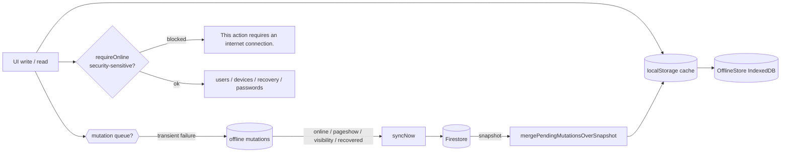

# Offline-first operation

PseudoPy is a installable PWA (iOS / Android / desktop) whose classroom workflows
must keep working when the network drops mid-lesson. This document explains how
offline-first data flows are structured, what is guaranteed to survive a restart,
and what is deliberately not allowed to happen while offline.

## Principles

- **Mirrored dual-write, synchronous reads.** Reads stay on the existing
  synchronous `localStorage` cache (`pseudopy_local_<ref>` via
  `getLocalCollection`/`setLocalCollection`). Every write is mirrored in parallel
  into an IndexedDB `OfflineStore` and, when Firestore is unavailable, recorded
  into a durable offline mutation queue.
- **Never silently drop a write.** If a write cannot reach Firestore it is
  persisted as a `PENDING` mutation and replayed automatically when connectivity
  returns. Permanent (non-transient) failures are surfaced as `FAILED` records,
  logged, and never fabricated as success.
- **Never silently clobber an unsynced change.** Snapshots from
  `onSnapshot`/`dbGetAll` overlay locally pending mutations so a reconnect cannot
  erase work that has not reached the cloud.
- **Security-sensitive actions stay online-only.** Device approval/revoke,
  password-recovery approval, role/status changes, archive/restore and password
  changes block with "This action requires an internet connection." instead of
  queueing.

## Component map

| Module | Role |
| --- | --- |
| `src/database/idb-store.js` | `OfflineStore`: durable mirrored copies of each collection, the mutation queue records, and sync/migration metadata. Also runs the idempotent, non-destructive `localStorage → IndexedDB` migration (`ensureOfflineDataMigration`). |
| `src/database/mutation-queue.js` | Coalescing queue (`enqueueMutation`, `listPendingMutations`, `updateMutationStatus`, ...) with an IndexedDB-first and `localStorage`-fallback backend. |
| `src/database/sync-manager.js` | Error taxonomy (`classifyDbError`), the drain loop (`syncNow`), bounded backoff retries, reachability tracking, `requireOnline()` gate and the app-driven sync triggers. |
| `src/database/collections.js` | `dbAdd`/`dbSet`/`dbUpdate` now write through `queueFirestoreWrite`; `dbGetAll`/`subscriptions-and-helpers.js` apply `mergePendingMutationsOverSnapshot`. |
| `src/app/on-demand.js` | Loads Skulpt (`./vendor/skulpt/*`) and PDF.js (`./vendor/pdfjs/*`) from bundled local assets. |
| `sw.js` | Installs the app shell, precaches the local Skulpt/PDF.js vendors, and vendor-caches the PDF worker — all fully offline. |

## Data flow

1. A write calls `dbAdd`/`dbSet`/`dbUpdate`.
2. `upsertLocalCache` updates `localStorage` synchronously and mirrors the doc
   into `OfflineStore` (best-effort, parallel).
3. `queueFirestoreWrite` attempts the Firestore write with a timeout:
   - **success** → clear any stale pending mutation for that doc, then kick `syncNow`.
   - **transient failure** (`OFFLINE`, `TIMEOUT`, `FIRESTORE_UNAVAILABLE`) → persist a `PENDING`
     mutation and schedule a backoff retry.
   - **permanent failure** (`PERMISSION_DENIED`, `INVALID_DATA`, `QUOTA`, `CONFLICT`, `UNKNOWN`)
     → structured `console.warn`, never queued, never reported as success.
4. `syncNow` replays `PENDING`/`SYNCING` records in `createdAt` order with a lock,
   at most `SYNC_MAX_ATTEMPTS = 3` attempts and backoff `[1500, 4000, 10000]ms`.
   A record that exhausts its attempts becomes `FAILED` and stays visible to the
   local-first reads so it is never overwritten.
5. Firestore snapshots (`subscribeCollection`, `dbGetAll`,
   `refreshAuthoritativeCaches`) run results through
   `mergePendingMutationsOverSnapshot`, which overlays any locally pending
   payload for an already-seen document and prepends new ones.

Sync triggers are application-driven (Firestore offline persistence does not
guarantee background-browser delivery): `online`, `pageshow`,
`visibilitychange → visible`, post-write, startup, and the degraded-boot
recovery in `session.js` (`syncNow('recovered')`).

## Offline matrix

| Capability | While offline (cold) | On reconnect |
| --- | --- | --- |
| Open the app / stay logged in | Bot splash, profile from local cache | `restoreSession` re-fetches Firestore; on failure stays cached with `AUTHENTICATED_DEGRADED` + connection banner |
| Read cached data (users, exercises, activity) | Yes, from localStorage | `refreshAuthoritativeCaches` reconciles via Firestore |
| Skulpt (Python execution) | Yes — bundled locally, precached by `sw.js` | Same (no network dependency) |
| PDF import | Yes — PDF.js + worker bundled locally, vendor-cached | Same |
| Write exercises/activity/settings | Queued (`dbAdd`/`dbSet`/`dbUpdate` → mutation queue) | Replayed deterministically, in order, idempotent (`documentId` fixed at enqueue time) |
| Duplicate sequential writes | Folds to one record via coalescing (ADD+UPDATE → one payload, etc.) | Single replay |
| Delete | Only via queued `DELETE` (Firestore idempotent) | Replayed after earlier ops for the same doc |
| Instructor device approve/revoke, password-recovery approval, role/status changes, archive/restore, password change | **Blocked.** `requireOnline()` returns `reason: 'online'/'reachability'` and the UI shows the same banner/message | Retry manually once Firestore is reachable |
| Student number allocation | Blocks when Firestore unreachable (unchanged) | Retry |
| Sync integrity | `getSyncState()` exposes pending/syncing/failed counts and `reachable` flag for tests and devtools | — |

## Error taxonomy (`classifyDbError`)

| Category | Example signals | Transient? | Behaviour |
| --- | --- | --- | --- |
| `OFFLINE` | `TypeError` / `NetworkError` / "Failed to fetch" | yes | queue + retry with backoff |
| `TIMEOUT` | `withFirestoreTimeout` message, `deadline-exceeded` | yes | queue + retry with backoff |
| `FIRESTORE_UNAVAILABLE` | `Unavailable`, `firestore/unavailable` | yes | queue + retry with backoff |
| `QUOTA` | `resource-exhausted` | no | `FAILED`, never retried or fabricated |
| `PERMISSION_DENIED` | `permission-denied`, `unauthenticated` | no | `FAILED`, never retried |
| `INVALID_DATA` | `invalid-argument`, `not-found`, `failed-precondition` | no | `FAILED` |
| `CONFLICT` | `aborted`, `conflict` | no | `FAILED` |
| `UNKNOWN` | anything else | no | `FAILED` (fail-safe, never silently dropped) |

`markFirestoreReachable` / `isFirestoreReachable` implement the reachability
model: `navigator.onLine` is only a hint; real proof comes from an actual
successful or failed Firestore operation.

## Bundling and the service worker

`src/bundles.json` loads the database modules in dependency order:

`local-storage.js → idb-store.js → mutation-queue.js → sync-manager.js → collections.js`

The service worker (`sw.js`) keeps two versioned caches:

- `CACHE_NAME` — app shell + local Skulpt (`./vendor/skulpt/skulpt.min.js`,
  `skulpt-stdlib.js`) + `devtools.js` + lucide/anime (non-blocking).
- `VENDOR_CACHE_NAME` — PDF.js library and worker.

Bump both version constants on `sw.js`:  whenever the precached files change.
Skulpt and PDF.js are loaded by `src/app/on-demand.js` from `CDN_BASE_URLS.*`
local paths with memoized `ensureSkulptLoaded`/`ensurePdfJsLoaded` (single shared
promise, no duplicate `<script>`/duplicate PDF worker set).

## Testing

- `tests/helpers/fake-idb.js` — in-memory IndexedDB for `OfflineStore`.
- `tests/offline-storage.test.js` — store round-trips, upserts, metadata, and the
  non-destructive `localStorage → IDB` migration.
- `tests/offline-queue.test.js` — coalescing rules, delete collapse, fallback queue.
- `tests/offline-sync.test.js` — taxonomy, bounded retries, `requireOnline`, sync drain.
- `tests/offline-wiring.test.js` — bundle ordering, queue routing, clobber
  protection and the security gates, read from the committed sources.

The pre-existing compiler-suite failures (`tests/compiler.test.js`) are expected
and unrelated to the offline layer.